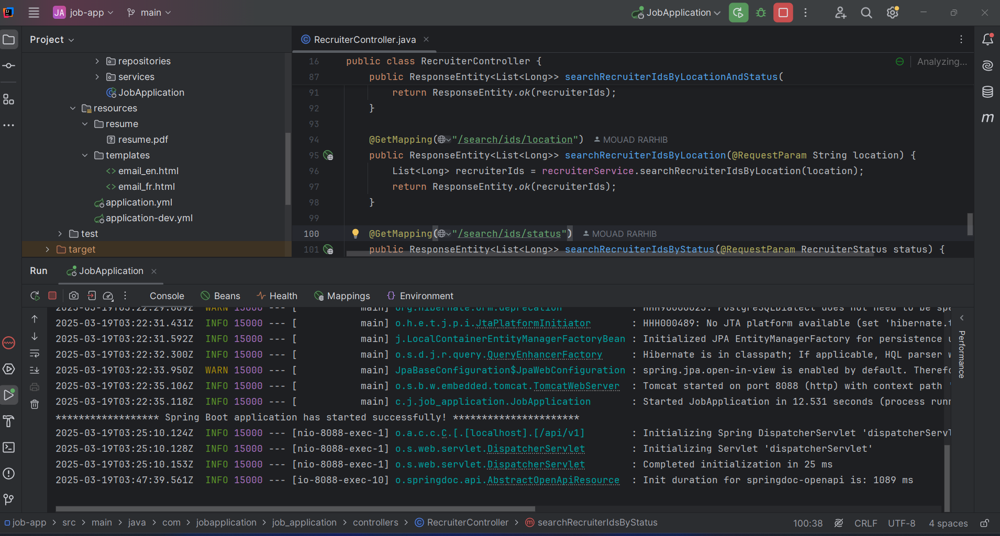
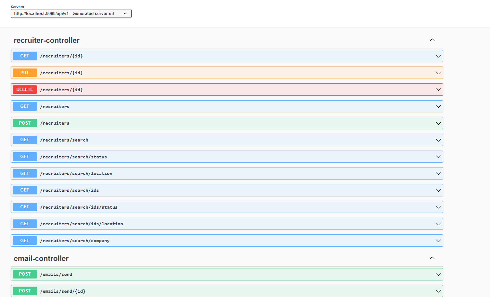
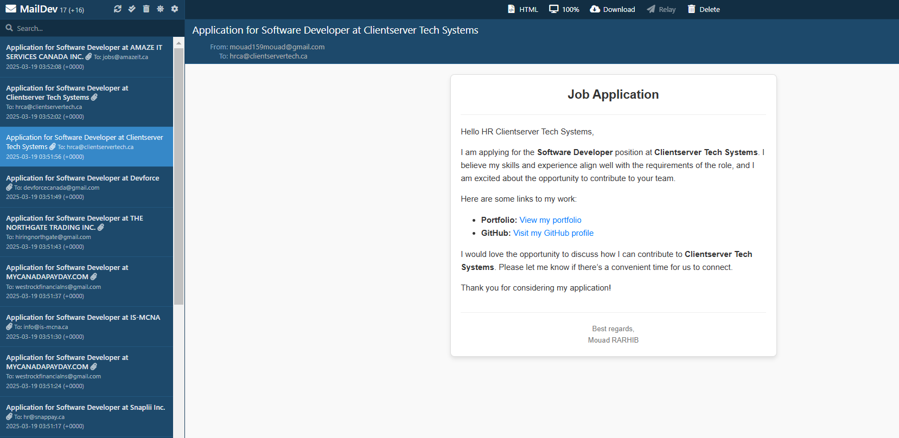

# 🚀 Job Application Tracker - Backend

  
*Powering the Job Application Tracker with a robust backend!*

---

## 📝 **Description**
This is the backend for the **Job Application Tracker** project. It provides APIs for:
- Managing recruiters (CRUD operations).
- Sending emails to recruiters individually or in bulk.
- Storing and retrieving recruiter data from the database.

The backend is built with modern technologies and follows best practices for scalability and maintainability.

---

## 🖼️ **Screenshots**

### 1. Backend Code and Structure
  
*Displaying part of the code, console logs, templates in the `resources` folder, and configuration files (`application.yml`, `application-dev.yml`).*

### 2. Swagger API Documentation
  
*Interactive API documentation generated using Swagger.*

### 3. MailDev Email Testing
  
*Testing email functionality with MailDev. Displays all received emails with their content.*

---

## 🛠️ **Technologies Used**
- **Backend Framework**: Spring Boot (Java)  
- **Database**: PostgreSQL or MySQL  
- **API Documentation**: Swagger  
- **Email Testing**: MailDev  
- **Deployment**: AWS, Docker, Jenkins  
- **Hosting**: AWS EC2 or ECS  

---

## 🚀 **API Documentation**
Explore the API endpoints using Swagger:  
👉 [Swagger UI](http://localhost:8080/swagger-ui.html) *(replace with your live URL if hosted)*

---

## 🔗 **Frontend Link**
The frontend for this project is hosted on Vercel. Check out the frontend repository here:  
👉 [Frontend Repository](https://github.com/your-username/frontend-repo)

---

## 🤝 **Contributing**
Contributions are welcome! If you'd like to contribute, please follow these steps:
1. Fork the repository.
2. Create a new branch (`git checkout -b feature/YourFeatureName`).
3. Commit your changes (`git commit -m 'Add some feature'`).
4. Push to the branch (`git push origin feature/YourFeatureName`).
5. Open a pull request.

---

## 📄 **License**
This project is licensed under the MIT License. See the [LICENSE](LICENSE) file for details.

---

## 🔧 **Badges**
  
  
  

---

## 📋 **Instructions**
1. Replace the following placeholders with your actual project details:
   - `https://github.com/your-username/backend-repo.git` → Link to your backend repository.
   - `https://github.com/your-username/frontend-repo` → Link to your frontend repository.
2. Ensure the `screenshots` folder is in the root of your project, and the images (`backend.png`, `swagger.png`, `maildev.png`) are placed inside it.
3. If you have a `LICENSE` file, make sure it’s in the root directory. If not, you can remove the **License** section or add one later.
